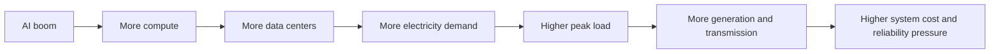
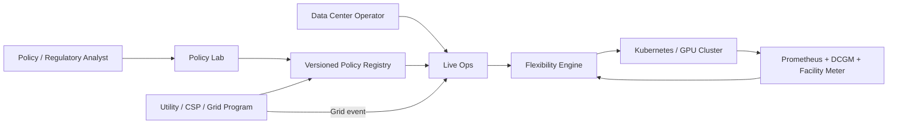
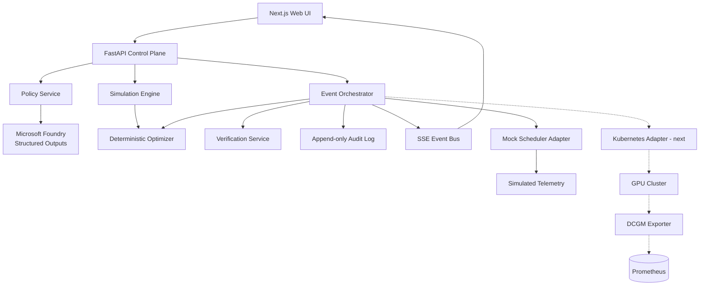
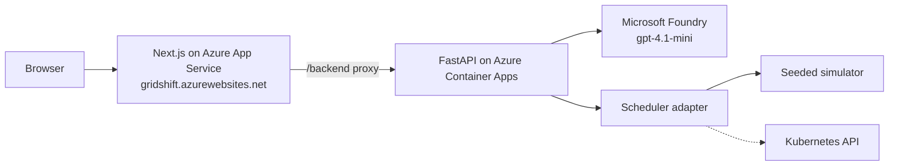
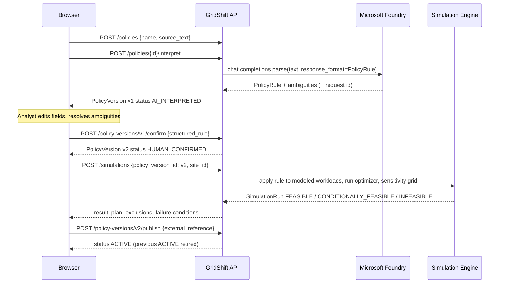
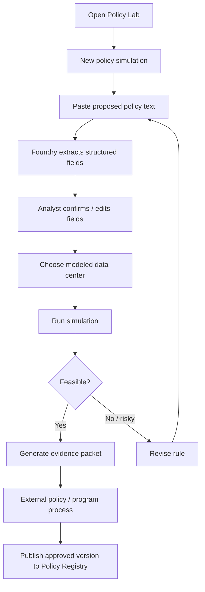
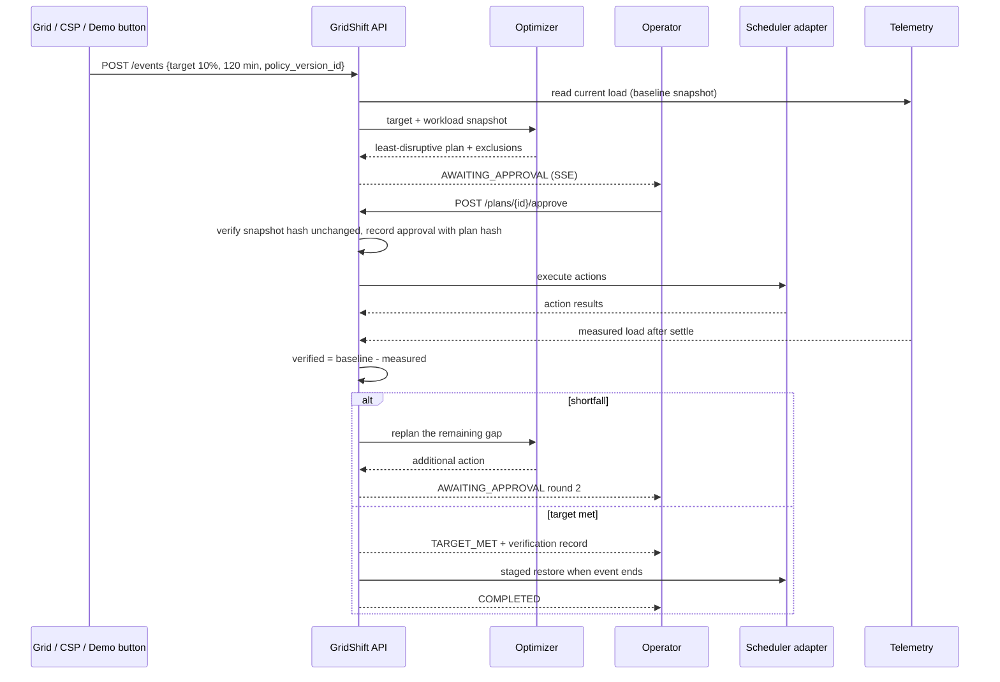
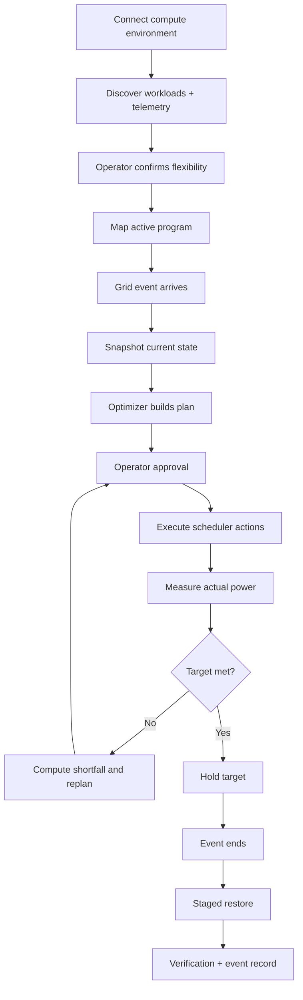
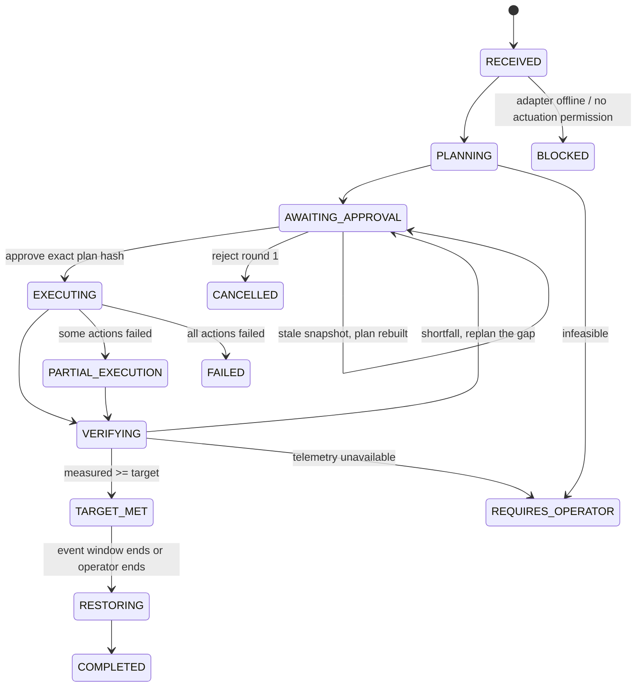
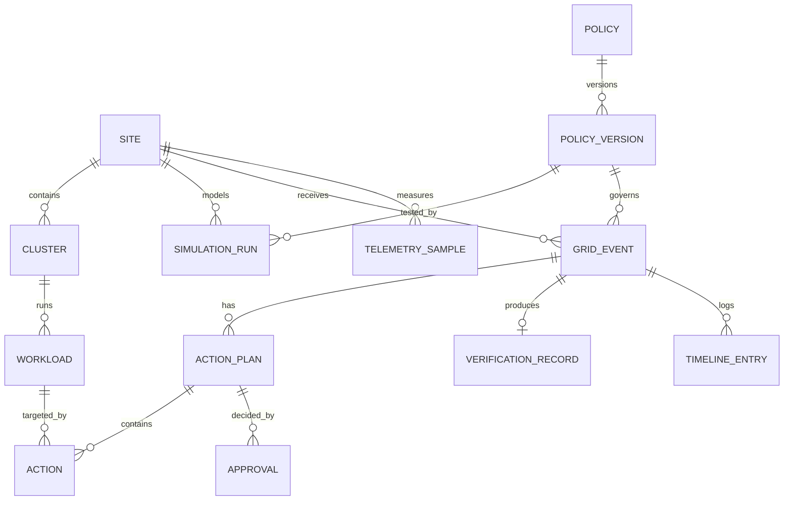

# GridShift

**Shift AI workloads to reduce peak power demand.**

GridShift is a grid-responsive control layer for AI data centers. When the grid is stressed, it finds the AI workloads that can safely move in time, plans the least-disruptive change, executes it through the data center's scheduler after operator approval, and **verifies the megawatts actually moved**.

Built for the **Microsoft + CCI Innovation Challenge for Virginia** (September 2026) using **Microsoft Foundry**.

| | |
|---|---|
| Live demo | **https://gridshift.azurewebsites.net** |
| Executive Challenge | **Policy and Public Sentiment Analyst** |
| Innovation Studio entry | https://innovationstudio.microsoft.com/hackathons/Microsoft-and-CCI-Innovation-Challenge-for-VA/project/126240 |
| Team | Sahil and Nikhil, George Mason University |
| Repository | https://github.com/sahiljagtap08/gridshift |
| Backend tests | 36 passing (`services/api/tests`) |
| Foundry eval set | 10/10 with `gpt-4.1-mini` (`scripts/foundry_eval.py`) |

---

## Contents

1. [The problem](#1-the-problem)
2. [What GridShift is](#2-what-gridshift-is)
3. [Where Microsoft Foundry fits](#3-where-microsoft-foundry-fits)
4. [Demo scenario](#4-demo-scenario)
5. [System architecture](#5-system-architecture)
6. [Request flows](#6-request-flows)
7. [Event state machine](#7-event-state-machine)
8. [Data model](#8-data-model)
9. [API reference](#9-api-reference)
10. [Optimizer](#10-optimizer)
11. [Verification and the demo power model](#11-verification-and-the-demo-power-model)
12. [Safety invariants](#12-safety-invariants)
13. [Tech stack](#13-tech-stack)
14. [Running locally](#14-running-locally)
15. [Deploying to Azure](#15-deploying-to-azure)
16. [Testing](#16-testing)
17. [Repository layout](#17-repository-layout)
18. [Impact and feasibility](#18-impact-and-feasibility)
19. [Roadmap](#19-roadmap)
20. [Sources](#20-sources)

---

## 1. The problem

AI growth means more compute, more data centers, and more electricity demand. Northern Virginia is already the largest data center market in the world, and Virginia's JLARC found data centers are the primary driver of the state's forecast electricity-demand growth. JLARC modeled that a typical Dominion residential customer could see an extra **$14 to $37 per month** in generation- and transmission-related cost by 2040.



Grid planners size the system for peak hours, and today they must treat data center load as rigid. But a large share of AI compute is **not** rigid. A training run with checkpoints, a nightly evaluation suite, or a batch embedding job can pause, throttle, or shift without hurting any end user. Only customer-facing inference truly needs every megawatt every second.

The real question is not "can AI use less electricity forever?" It is:

> **When the grid is constrained, which AI workloads can safely move in time, by how much, for how long, and can we prove the resulting MW reduction?**

That is a scheduling and control problem. GridShift solves it.

> Keep the AI growth. Make the flexible part of its demand actually flexible.

## 2. What GridShift is

One engine, two surfaces.

| Surface | Question it answers | User |
|---|---|---|
| **Policy Lab** | *Would this demand-flexibility rule work against real workloads?* | Policy, utility, or regulatory analyst |
| **Live Ops** | *Can we execute the active rule right now, and prove what happened?* | Data center / AI infrastructure operator |

Both surfaces share the same policy schema, workload model, optimizer, action vocabulary, and verification model. A rule tested in Policy Lab is the same object that governs a live event once it is externally approved.

### The core loop

```
Rule -> observe -> plan -> approve -> act -> measure -> verify -> restore
```

1. A grid event arrives: *"reduce 10% for 2 hours."*
2. GridShift freezes a snapshot of workloads and power telemetry (the baseline).
3. A deterministic optimizer builds the least-disruptive plan that meets the target, checking allowed actions, max pause, throttle limits, and deadlines. Protected workloads are a hard gate and can never be selected.
4. The operator reviews exactly what will change and approves. Approval is bound to the plan hash and the workload snapshot.
5. Actions execute through a scheduler adapter (mock adapter for the demo; Kubernetes Job suspend/resume is the first real actuator).
6. Power telemetry is measured continuously. **Expected** and **measured** reduction are always separate numbers.
7. If the target is missed, GridShift reports the shortfall, replans only the gap, and asks for approval again. It never claims success from API calls alone.
8. When the event ends, workloads are restored in stages to avoid a rebound peak, and an auditable verification record is produced.

### How this answers the "Policy and Public Sentiment Analyst" challenge

Policy analysis tools usually stop at explaining a rule. GridShift's Policy Lab takes a proposed demand-flexibility rule written in plain language, turns it into a strict, machine-checkable constraint set with Microsoft Foundry, makes the analyst confirm every assumption, and then **tests the rule against a modeled data center**: is it feasible, which workloads would move, how many megawatts would it free, and what would make it fail. Each run is a versioned, reproducible evidence packet an analyst can bring to a stakeholder or regulatory process. The same confirmed rule then governs Live Ops, so the policy conversation and the operational result are the same object. That is the difference between analyzing policy and making it executable.

### What GridShift is not

Not a policy chatbot, not a PDF summarizer, not a utility, not a PJM market participant, and not an LLM deciding which production workloads to kill. The LLM interprets text. Deterministic code plans, acts, and verifies.

## 3. Where Microsoft Foundry fits

Foundry is used for **structured policy interpretation**, and only that. An analyst pastes plain-language program text such as:

> During declared grid stress events, participating large-load customers should reduce non-critical electricity demand by 15% for up to two hours while protecting critical customer-facing services.

The backend sends the text plus the strict `PolicyRule` JSON Schema to a Foundry model deployment using **Structured Outputs**. The model fills the schema:

```json
{
  "reduction_target": {"type": "percent_of_baseline", "value": 15},
  "duration_minutes": 120,
  "response_time_minutes": null,
  "trigger": {"type": "declared_grid_stress_event", "description": "declared grid stress event"},
  "protected_workload_classes": ["critical_inference"],
  "flexible_workload_classes": ["training", "batch", "evaluation", "embeddings", "synthetic_data"],
  "allowed_actions": ["suspend", "throttle", "defer"],
  "operator_approval_required": true,
  "ambiguities": [
    {"field": "response_time_minutes", "reason": "policy does not define event notification lead time"}
  ],
  "summary": "Reduce non-critical load by 15% for up to 120 minutes during declared grid stress events, protecting critical inference; manual approval required."
}
```

Three design rules keep this safe:

- **Missing values are reported, never invented.** The schema has an explicit `ambiguities` list. A 10-example hand-labelled eval set checks this (`scripts/foundry_eval.py`).
- **A human confirms every field.** The interpreted version is `AI_INTERPRETED`. Only after an analyst confirms it does a new `HUMAN_CONFIRMED` version exist, and only that can be simulated.
- **Foundry never touches infrastructure.** It never sends a command and never receives credentials or cluster data. Only externally approved `ACTIVE` policy versions can drive Live Ops.

Without Foundry credentials the parser falls back to a labelled offline heuristic so the demo still runs. The UI shows which interpreter produced each version, with the Foundry request ID.

The full schema is in [`docs/policy-schema.md`](docs/policy-schema.md).

## 4. Demo scenario

Modeled site: **Virginia AI Campus, 12.6 MW** (Ashburn, Dominion / PJM territory)

| Workload | Power | Criticality | Protected | Flexibility | Deadline |
|---|---:|---|---|---|---|
| Production inference | 3.2 MW | critical | Yes | none | continuous |
| Model training | 4.5 MW | medium | No | throttle (to 50%) / checkpoint-pause | +14 h |
| Embeddings refresh | 1.4 MW | low | No | delay | +90 min |
| Evaluation suite | 1.1 MW | low | No | suspend (checkpointed) | +9 h |
| Synthetic data generation | 2.4 MW | low | No | suspend (checkpointed) | +12 h |

Active program: *Reduce non-critical load by at least 10% for up to 120 minutes during a grid stress event. Do not interrupt critical customer-facing inference. Manual operator approval is required.*

**Event:** 10% for 120 minutes, target **1.26 MW**.

**Plan:** throttle training by 10% (0.45 MW) and suspend the checkpointed evaluation suite (1.05 MW) for an expected **1.50 MW**. Zero critical workloads touched. The embeddings job is excluded automatically because its deadline falls inside the event window, and the approval screen says so.

**Under-delivery path:** toggle *Simulate under-delivery* and the first plan lands at about 1.13 MW. GridShift reports the shortfall, replans only the 0.13 MW gap (raise the training throttle to 25%), asks for approval again, verifies about 1.9 MW against the 1.26 MW target, holds, then restores in stages.

Everything is seeded (`DEMO_RANDOM_SEED=42`) so the presentation is repeatable. The walkthrough is in [`docs/demo.md`](docs/demo.md).

## 5. System architecture

### System context



### Components



| Component | Path | Responsibility |
|---|---|---|
| Domain models | `services/api/app/models/` | Workload contract, `PolicyRule` schema, event / plan / action / verification records |
| Foundry policy parser | `services/api/app/services/foundry_policy_parser.py` | Text to strict `PolicyRule` via Structured Outputs; ambiguity reporting; offline fallback |
| Optimizer | `services/api/app/services/optimizer.py` | Least-disruption plan under hard constraints, with exclusion reasons |
| Simulation engine | `services/api/app/services/simulation.py` | Runs a confirmed rule against a modeled site; sensitivity grid; failure conditions |
| Event orchestrator | `services/api/app/services/orchestrator.py` | State machine, approval binding, execution, verification, replan, staged restore |
| Verification | `services/api/app/services/verification.py` | Baseline minus measured; `UNVERIFIED` without telemetry |
| Mock adapter | `services/api/app/adapters/mock.py` | Seeded cluster simulator: power model, action latency, noise, under-delivery, failure injection |
| REST + SSE API | `services/api/app/api/` | Clusters, workloads, events, plans, policies, simulations, registry, audit, streams |
| Web UI | `apps/web/` | Landing, Overview, Live Ops with interactive 3D facility view, Policy Lab, Programs, Workloads, Events |

### Deployment boundary



## 6. Request flows

### Policy interpretation (Policy Lab)



### Policy Lab user flow



### Live grid event (Live Ops)



### Live Ops user flow



## 7. Event state machine



A partially executed event is never collapsed into "failed": what already changed is preserved, shown, and restored.

## 8. Data model



Versioned entities are append-only: a policy version is never edited in place, every replan is a new plan with its own round number, and every approval stores the plan hash it applied to.

### Key entities

**Workload** (scheduler-independent contract)

| Field | Meaning |
|---|---|
| `nominal_power_mw`, `current_power_mw` | Unconstrained draw and live draw |
| `criticality`, `protected` | Operator-owned importance; `protected=true` is a hard gate |
| `checkpointable`, `max_pause_minutes`, `max_throttle_percent`, `deadline_at` | Flexibility limits the optimizer must respect |
| `allowed_actions` | Subset of `suspend`, `throttle`, `defer`, `none` |
| `state`, `throttle_percent`, `generation` | Runtime state; `generation` bumps on every change and feeds the snapshot hash |

**PolicyVersion**

| Field | Meaning |
|---|---|
| `structured_rule` | The `PolicyRule` object (see section 3) |
| `status` | `AI_INTERPRETED` → `HUMAN_CONFIRMED` → `SIMULATED` → `EXTERNALLY_APPROVED` → `ACTIVE` → `RETIRED` |
| `interpretation_model`, `foundry_request_id` | Provenance of the interpretation |
| `confirmed_by`, `confirmed_at`, `external_reference` | Human and external authorization trail |

**GridEvent**

| Field | Meaning |
|---|---|
| `baseline_mw` | Facility load snapshot at receipt (`DEMO_PRE_EVENT_SNAPSHOT`) |
| `target_reduction_mw`, `duration_minutes`, `response_time_minutes` | The requirement |
| `policy_version_id` | Immutable link to the governing rule |
| `status`, `plan_ids`, `active_plan_id`, `verification_id` | Lifecycle |

**ActionPlan** and **Action**

| Field | Meaning |
|---|---|
| `round` | 1 for the initial plan, 2+ for shortfall replans |
| `workload_snapshot_hash`, `workload_snapshot` | What the plan was built against; stale hash invalidates it |
| `target_reduction_mw`, `expected_reduction_mw`, `disruption_score` | The gap this plan covers and the modeled result |
| `actions[]` | `workload_id`, `action_type`, `parameters`, `expected_reduction_mw`, `reason`, `user_impact`, `recovery`, `status`, `result` |
| `exclusions[]` | Workload/action pairs ruled out and why (protected, deadline, max pause, throttle cap) |

**VerificationRecord**

| Field | Meaning |
|---|---|
| `baseline_method`, `baseline_mw`, `actual_mw` | Inputs |
| `expected_reduction_mw` | Sum of executed action estimates (a model) |
| `verified_reduction_mw`, `target_met` | Measured result; `null` and `UNVERIFIED` when no telemetry exists |
| `critical_workloads_impacted`, `deadline_misses`, `actions_executed`, `calculation` | Evidence |

The hackathon build keeps these in an in-memory store seeded on startup. The schema maps one-to-one onto the PostgreSQL tables planned for production.

## 9. API reference

Base path: `/api/v1`. All state-changing endpoints accept an `Idempotency-Key` header so a double click or retry never suspends or restores twice.

### Site, clusters, workloads

| Method | Path | Purpose |
|---|---|---|
| GET | `/overview?site_id=` | Current, flexible, and protected load, active event, active program, cluster health |
| GET | `/sites` · `/clusters` · `/clusters/{id}` | Inventory |
| POST | `/clusters` | Connect a cluster (observe-only by default) |
| PATCH | `/clusters/{id}/permissions` | Grant or revoke `observe_enabled` / `actuation_enabled` separately |
| POST | `/clusters/{id}/sync` | Re-discover workloads through the adapter |
| GET | `/clusters/{id}/workloads` · `/workloads` | Normalized workload inventory |
| PATCH | `/workloads/{id}/flexibility` | Operator sets protected, criticality, checkpointable, limits, allowed actions |
| GET | `/telemetry?site_id=&limit=` | Recent facility and per-workload power samples |

### Policy Lab and registry

| Method | Path | Purpose |
|---|---|---|
| POST | `/policies` | Create a policy from source text |
| GET | `/policies` · `/policies/{id}` | Policies with their versions |
| POST | `/policies/{id}/interpret` | Foundry Structured Outputs → `AI_INTERPRETED` version |
| GET | `/policy-versions/{id}` | One immutable version |
| POST | `/policy-versions/{id}/confirm` | Human-confirmed copy → new `HUMAN_CONFIRMED` version |
| POST | `/policy-versions/{id}/publish` | Mark `ACTIVE` with an external reference; retires the previous active version; refuses unresolved ambiguities |
| GET | `/policy-registry` | Every version with its status, for the Programs page |
| POST | `/simulations` | Run a confirmed version against a site |
| GET | `/simulations` · `/simulations/{id}` | Results with plan, exclusions, sensitivity, failure conditions |

### Live Ops

| Method | Path | Purpose |
|---|---|---|
| POST | `/events` | Receive a grid event; snapshots baseline and builds round-1 plan |
| GET | `/events` · `/events/{id}` | Event with plans, approvals, verification, timeline, policy version |
| GET | `/plans/{id}` | One plan |
| POST | `/plans/{id}/approve` | Approve; returns `409` with `new_plan_id` if the workload snapshot changed |
| POST | `/plans/{id}/reject` | Reject; cancels a round-1 event or flags a replan for the operator |
| POST | `/events/{id}/end` | End the event early and start staged restore |
| POST | `/events/{id}/cancel` | Cancel; restores anything already changed |
| GET | `/events/{id}/verification` | The verification record |
| GET | `/stream` · `/events/{id}/stream` | Server-Sent Events: `telemetry` and `event` frames |

### Operations

| Method | Path | Purpose |
|---|---|---|
| GET | `/audit?limit=` | Append-only audit log, newest first |
| POST | `/demo/reset` | Reseed the demo site |
| GET | `/health` (root) | Liveness plus whether Foundry is configured |

Example: create the demo event and read the plan.

```bash
curl -s -X POST localhost:8000/api/v1/events \
  -H 'content-type: application/json' \
  -d '{"target": {"type": "percent", "value": 10}, "duration_minutes": 120}'
```

```json
{
  "event": {"id": "evt_0001", "status": "AWAITING_APPROVAL", "baseline_mw": 12.6, "target_reduction_mw": 1.26},
  "active_plan": {
    "round": 1, "expected_reduction_mw": 1.495, "workload_snapshot_hash": "55c40093f49101ff",
    "actions": [
      {"workload_name": "Model training", "action_type": "throttle", "parameters": {"throttle_percent": 0.1}, "expected_reduction_mw": 0.45},
      {"workload_name": "Evaluation suite", "action_type": "suspend", "expected_reduction_mw": 1.045}
    ],
    "protected_workload_ids": ["workload_inference"],
    "exclusions": [
      {"workload_name": "Production inference", "action_type": "*", "reason": "protected workload (hard gate)"},
      {"workload_name": "Embeddings refresh", "action_type": "defer", "reason": "deadline 00:05 UTC falls inside the event window"}
    ]
  }
}
```

## 10. Optimizer

The optimizer is deterministic code, not a model.

1. **Enumerate candidates** per workload: throttle at 10 / 25 / 50%, suspend, defer.
2. **Apply hard constraints**: protected workloads are skipped; the action must be in `allowed_actions`; throttle level must be within `max_throttle_percent`; suspend and defer must fit `max_pause_minutes` and finish before `deadline_at` with a 30-minute buffer. Every rejected candidate is recorded with its reason and shown on the approval screen.
3. **Score disruption**: throttle 10% = 1.0, 25% = 1.8, 50% = 3.0; checkpointed suspend = 2.0; defer = 1.5; non-checkpointed suspend = 6.0; multiplied by criticality (low 1.0, medium 1.25, high 2.0).
4. **Choose the plan** that minimizes `total disruption + 2.0 × overshoot` subject to delivering the target with a 5% planning margin. At most one action per workload.

The candidate space is tiny, so the search is exhaustive and provably optimal. Production swaps in OR-Tools behind the same interface; the hard constraints stay outside any model.

## 11. Verification and the demo power model

**Verification** is baseline minus measured, over the samples taken after the last action settled:

```
verified_reduction_mw = baseline_mw - mean(facility_power_mw, post-action window)
target_met            = verified_reduction_mw >= target_reduction_mw
```

With no telemetry the record is `UNVERIFIED` and `target_met` is `null`. Scheduler success is never a substitute.

**Demo power model** (explicit assumptions, not physics claims):

| State | Power |
|---|---|
| running | 100% of nominal |
| throttled p | (1 − p) × nominal |
| suspended | 5% residual |
| deferred | 0 |

After an action the actual response is the modeled reduction scaled by a seeded factor in [0.94, 1.02]. The *simulate under-delivery* toggle scales the first plan's response to 75% so the shortfall path is visible. Facility power = IT power × PUE, with PUE = 1.0 shown as a site parameter. Production replaces this with NVIDIA DCGM GPU power through Prometheus for attribution and a facility or revenue-grade meter for settlement.

## 12. Safety invariants

| Invariant | Enforced in |
|---|---|
| Protected workloads never appear in an executable plan | `optimizer.enumerate_candidates` skips them; `MockAdapter.validate_action` refuses them |
| AI-interpreted rules cannot be simulated or executed | `simulation.run_simulation` and `orchestrator.create_event` check version status |
| Execution requires explicit operator approval bound to the plan hash and workload snapshot | `orchestrator.approve` stores `plan_hash`; stale snapshot returns `409` and rebuilds |
| Success requires measured telemetry | `verification.compute_verification` |
| Expected and measured MW are separate fields everywhere | `ActionPlan.expected_reduction_mw` vs `VerificationRecord.verified_reduction_mw`; separate UI metrics |
| Every action is audit logged before and after | `core/audit.record_audit` |
| Restoration is a first-class phase | `orchestrator._restore`, staged by criticality, then `COMPLETED` |
| Read and write permissions are separate | `Cluster.observe_enabled` vs `actuation_enabled`; event is `BLOCKED` without actuation |
| Foundry never receives infrastructure credentials | The parser receives only policy text |

## 13. Tech stack

| Layer | Choice |
|---|---|
| Frontend | Next.js 16, React 19, TypeScript, Tailwind CSS v4, Recharts, React Three Fiber + drei for the 3D facility, native EventSource for SSE |
| Backend | Python 3.12, FastAPI, Pydantic v2, sse-starlette |
| AI | Microsoft Foundry model deployment (`gpt-4.1-mini`) via the OpenAI SDK with Structured Outputs |
| Optimization | Deterministic exhaustive least-disruption search (OR-Tools on the roadmap) |
| Telemetry | Seeded simulator; designed for Prometheus + NVIDIA DCGM Exporter |
| Actuation | Mock scheduler adapter; Kubernetes Job `spec.suspend` adapter next |
| Hosting | Azure App Service front door, Azure Container Apps (API), Azure Container Registry, Docker Compose locally |

## 14. Running locally

```bash
cp .env.example .env   # optional: add Foundry endpoint, key, deployment name

# backend
cd services/api
python -m venv .venv && source .venv/bin/activate
pip install -r requirements.txt
uvicorn app.main:app --reload --port 8000

# frontend (new terminal)
cd apps/web
npm install
npm run dev
```

Open http://localhost:3000. The demo site is seeded automatically. Without Foundry credentials the policy parser uses the offline fallback and the UI labels it as such.

```bash
# drive the whole Live Ops loop from the terminal
python scripts/run_demo_event.py --under-delivery

# or with Docker
docker compose up --build
```

## 15. Deploying to Azure

```bash
az login
LOCATION=westus ./infra/azure/deploy.sh
```

The script builds both images locally (Azure for Students subscriptions do not permit ACR cloud builds), pushes them to Azure Container Registry, deploys the API and web to Container Apps, and points the App Service front door (`gridshift.azurewebsites.net`) at the new web image. The browser only ever talks to the web app; it reaches the API through a runtime proxy (`apps/web/app/backend/[...path]/route.ts`) that also streams Server-Sent Events. Foundry settings are read from `.env`. The Foundry resource itself was created with:

```bash
az cognitiveservices account create -n gridshift-foundry -g gridshift-rg -l westus --kind AIServices --sku S0
az cognitiveservices account deployment create -n gridshift-foundry -g gridshift-rg \
  --deployment-name gpt-4.1-mini --model-name gpt-4.1-mini --model-version 2025-04-14 \
  --model-format OpenAI --sku-name GlobalStandard --sku-capacity 50
```

## 16. Testing

```bash
cd services/api && .venv/bin/python -m pytest -q      # 36 tests
.venv/bin/python ../../scripts/foundry_eval.py         # 10 labelled policy texts
cd apps/web && npm run build && npm run lint
```

| Suite | What it pins |
|---|---|
| `test_optimizer.py` | Protected never selected; demo plan is deterministic and prefers the low-disruption pair; infeasible targets; deadline, max pause, and allowed-action constraints; replan raises the throttle level |
| `test_verification.py` | 12.6 → 10.9 verifies 1.7 MW; shortfall is not target met; no telemetry is `UNVERIFIED` |
| `test_mock_adapter.py` | Power table, seeded determinism, protected refusal, under-delivery on first round only, restore, failure injection |
| `test_orchestrator.py` | Full loop to `COMPLETED`; under-delivery → replan → target met; stale snapshot → `409` and rebuild; non-active policy rejected; infeasible → `REQUIRES_OPERATOR`; no actuation → `BLOCKED`; partial execution |
| `test_api_events.py` | REST lifecycle, idempotency, flexibility edit invalidates plan, reject cancels |
| `test_policy_lab.py` | Fallback never invents duration; unconfirmed rule cannot simulate; interpret → confirm → simulate → publish via API |
| `foundry_eval.py` | Explicit percent, MW target, missing duration, vague protection, no trigger, throttle-only, automatic curtailment, multiple conditions, no target, shift language |

## 17. Repository layout

```
gridshift/
├── apps/web/                 Next.js UI
│   ├── app/                  routes: / (landing), /overview, /live-ops, /facility, /workloads, /events, /programs, /policy-lab
│   ├── components/           Shell, PowerChart, PlanTable, Timeline, RuleCards, EventModal, ui
│   ├── components/facility/  3D campus scene (React Three Fiber): racks, cooling, switchgear, substation
│   └── lib/                  typed API client, types, SSE hook, formatting
├── services/api/             FastAPI control plane
│   ├── app/models/           domain models
│   ├── app/services/         foundry_policy_parser, optimizer, simulation, orchestrator, verification
│   ├── app/adapters/         scheduler adapter protocol and mock adapter
│   ├── app/api/              routers
│   ├── app/core/             config, store, seed, audit, SSE bus
│   └── tests/                pytest suites and the policy eval fixture
├── docs/                     architecture.md, demo.md, policy-schema.md, pitch.md
├── infra/azure/              Container Apps deploy script
├── scripts/                  run_demo_event.py, foundry_eval.py
└── docker-compose.yml
```

## 18. Impact and feasibility

**Impact, stated honestly.** GridShift does not claim to eliminate grid buildout or to save Virginians a specific dollar figure. It targets one controllable contributor to future grid cost: avoidable peak demand from flexible AI workloads. Every verified megawatt that can move during a constrained period is capacity the grid no longer has to treat as completely rigid. PJM already compensates qualified demand response and estimates it saves $265M to $355M per year across its footprint by reducing the need for new generation; that is a system-wide figure, not a GridShift claim.

**The causal chain:** GridShift → verified flexible MW → lower peak system requirement and market stress → potential system-cost and reliability benefit → resident benefit.

**Feasibility.** Every building block exists today. Kubernetes can suspend Jobs. NVIDIA DCGM exposes GPU power in Prometheus format. PJM compensates demand response through Curtailment Service Providers. Dominion Energy is developing a Large Load Demand Flexibility Program under 2026 Virginia legislation, with an SCC filing planned for January 2027. Foundry turns program text into a strict schema. GridShift connects those pieces into one safe, workload-aware, verifiable control loop, and treats market participation as an integration boundary rather than pretending to replace PJM or a CSP.

**Positioning.** Flexible AI data centers are an active commercial category (Emerald AI, for example). GridShift's approach is the policy-to-execution continuity: test the rule against real workloads, then use the same constraint model to operate and verify the response. Most policy tools explain a rule. GridShift tests and executes one.

## 19. Roadmap

| Version | Scope |
|---|---|
| V1 (this build) | One modeled site, mock scheduler, Foundry policy extraction, human-confirmed rules, deterministic optimizer, manual approval, simulated telemetry, verification, staged restore |
| V2 | Read-only Kubernetes and DCGM/Prometheus integration, operator workload tagging, shadow mode, event replay, real suspend/resume on selected batch Jobs, site-specific power model |
| V3 | Facility meter, CSP/utility event API, program-valid baseline methodology, mTLS cluster agent, HA control plane, OR-Tools, enterprise RBAC and audit |
| V4 | Multi-site, geographic shifting where appropriate, carbon/price/congestion signals, automatic operating envelopes, CSP marketplace integrations |

## 20. Sources

- Virginia JLARC, *Data Centers in Virginia* (2024): https://jlarc.virginia.gov/landing-2024-data-centers-in-virginia.asp
- Dominion Energy, Demand Flexibility: https://www.dominionenergy.com/about/delivering-energy/demand-flexibility
- PJM, Demand Response: https://www.pjm.com/markets-and-operations/demand-response.aspx
- PJM, Curtailment Service Providers: https://www.pjm.com/markets-and-operations/demand-response/csps
- PJM, The Value of PJM (demand response savings estimate): https://www.pjm.com/-/media/DotCom/about-pjm/the-value-of-pjm.pdf
- Microsoft Foundry documentation: https://learn.microsoft.com/en-us/azure/foundry/
- Microsoft Foundry, Structured Outputs: https://learn.microsoft.com/en-us/azure/foundry/openai/how-to/structured-outputs
- NVIDIA DCGM Exporter metrics: https://docs.nvidia.com/datacenter/dcgm/latest/reference/dcgm-exporter-metrics.html
- Kubernetes Jobs (suspend): https://kubernetes.io/docs/concepts/workloads/controllers/job/
- Emerald AI (competitive context): https://www.nvidia.com/en-us/case-studies/emerald-ai/
