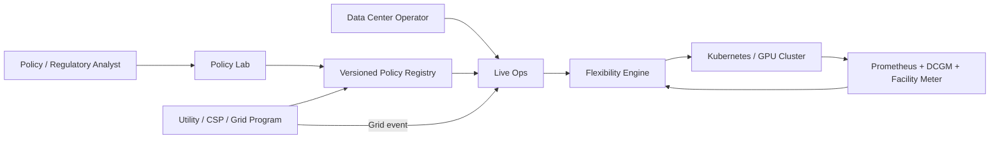
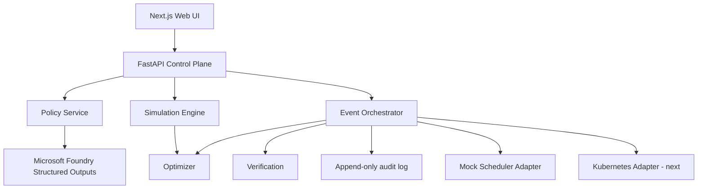
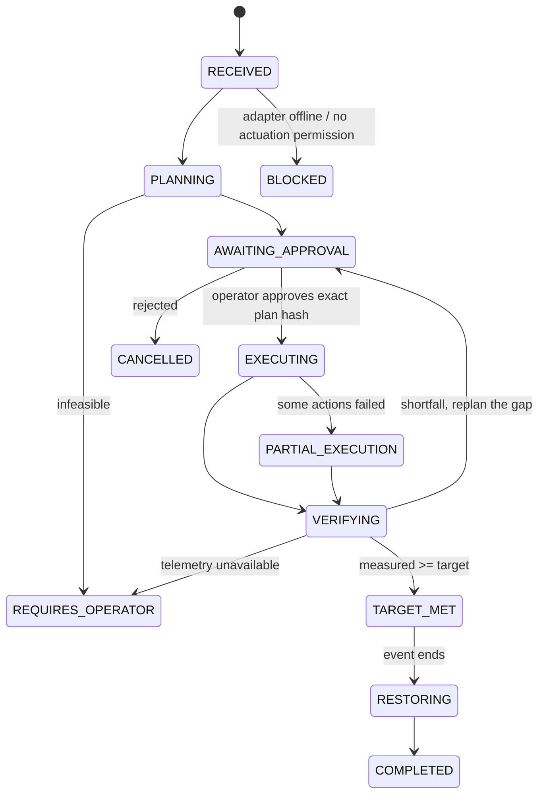

# GridShift architecture

## One engine, two surfaces

Policy Lab and Live Ops share the policy schema, workload model, optimizer, action vocabulary, and verification model. Policy Lab answers "would this rule work?"; Live Ops answers "can we execute it now, and prove what happened?"

## Components

| Component | Location | Responsibility |
|---|---|---|
| Domain models | `services/api/app/models/` | Workload contract, PolicyRule schema, event/plan/action/verification records |
| Foundry policy parser | `services/api/app/services/foundry_policy_parser.py` | Plain text to strict `PolicyRule` via Structured Outputs; reports ambiguities; offline fallback |
| Optimizer | `services/api/app/services/optimizer.py` | Deterministic least-disruption plan under hard constraints |
| Simulation | `services/api/app/services/simulation.py` | Runs a confirmed rule against a modeled site; sensitivity and failure conditions |
| Orchestrator | `services/api/app/services/orchestrator.py` | Grid-event state machine, approval, execution, verification, replan, staged restore |
| Verification | `services/api/app/services/verification.py` | Baseline minus measured; UNVERIFIED without telemetry |
| Mock adapter | `services/api/app/adapters/mock.py` | Seeded cluster simulator: power model, action latency, noise, under-delivery |
| API | `services/api/app/api/` | REST + Server-Sent Events |
| Web UI | `apps/web/` | Overview, Live Ops, Policy Lab, Programs, Workloads, Events |

## Event state machine

## Safety invariants enforced in code

| Invariant | Where |
|---|---|
| Protected workloads never appear in a plan | `optimizer.enumerate_candidates` skips them; adapter `validate_action` refuses them |
| AI-interpreted rules cannot be simulated or executed | `simulation.run_simulation` and `orchestrator.create_event` check version status |
| Execution requires explicit approval tied to the plan hash and workload snapshot | `orchestrator.approve` records `plan_hash`; stale snapshot returns 409 and rebuilds the plan |
| Success requires measured telemetry | `verification.compute_verification` returns UNVERIFIED with no samples |
| Expected and measured MW are separate fields | `ActionPlan.expected_reduction_mw` vs `VerificationRecord.verified_reduction_mw` |
| Every action is audit logged | `core/audit.record_audit` before and after each action |
| Restoration is a first-class phase | `orchestrator._restore` staged by priority, then COMPLETED |
| Foundry never receives infrastructure credentials | parser only receives policy text |

## Optimizer

Candidates are enumerated per workload (throttle levels 10/25/50%, suspend, defer) with legality checks: allowed actions, max throttle, max pause, and deadline with a 30-minute buffer. Each candidate has a disruption cost (throttle < checkpointed suspend < defer < lossy suspend, scaled by criticality). The plan minimizes total disruption plus an overshoot penalty, subject to delivering the target with a 5% planning margin. The candidate space is tiny, so the search is exhaustive and provably optimal; production swaps in OR-Tools behind the same interface.

## Demo power model (explicit assumptions)

| State | Power |
|---|---|
| running | 100% of nominal |
| throttled p | (1 - p) × nominal |
| suspended | 5% residual |
| deferred | 0 |

Actual response after an action is the modeled reduction scaled by a seeded factor in [0.94, 1.02]. The "simulate under-delivery" toggle scales the first plan's response to 75% so the shortfall and replan path is visible. Facility power = IT power × PUE (1.0 in the demo, visible as a site parameter). Seed is 42.

## Production evolution

V2: read-only Kubernetes and DCGM/Prometheus integration, shadow mode, real suspend/resume on selected batch Jobs. V3: facility meter, CSP/utility event API, program-valid baseline methodology, mTLS agent, OR-Tools. See the README for the rest.
